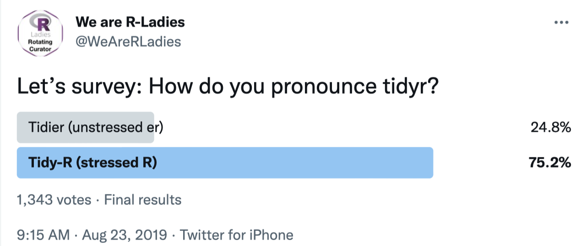

class: inverse, middle, center
background-image: url(https://tidyr.tidyverse.org/logo.png)
background-size: 120px 120 px
background-position: top

\
&nbsp;
\
&nbsp;

# tidyr, c'est quoi?


"*tidy datasets are all alike, but every messy dataset is messy in its own way*" 

Hadley Wickham 
<!-- c'est la promesse de plus de temps consacré à l'analyse -->

---
class: inverse, middle

# Prologue 

### Prononciation : le débat

#### / ˈtaɪdi ɑː / ?

Les experts ne s'entendent pas quant à la façon dont l'usager doit prononcer le néologisme « tidyr » :



<!-- Aussi, « tidyr » ne prend jamais de majuscule -->

---
class: inverse, top

# Prologue (suite)

### Les données que nous manipulerons

<!-- Je vous propose de découvrir le package en utilisant ses fonctions pour nettoyer une vraie base de données. -->


Les données que nous manipulerons proviennent du package **palmerpenguins** :

&nbsp;
&nbsp;


```{r}
df <- palmerpenguins::penguins
```
&nbsp;
&nbsp;


--

Puisque cette présentation porte sur tidyr, nous utiliserons les données brutes histoire de les « nettoyer ». 
&nbsp;
&nbsp;

--

Plus de détails sur cette base de données [ici](https://allisonhorst.github.io/palmerpenguins/) 

&nbsp;
&nbsp;


<!-- Sachez qu'à même le package, il existe toutefois des data frames nommées table1, 2, 3, 4, etc. Ceux-ci ont été conûs avec les défauts, le « untidyness », auxquel tidyr permet de palier.  -->

---
class: inverse, middle, center


---
background-image: url(https://allisonhorst.github.io/palmerpenguins/man/figures/lter_penguins.png)
background-position: 50% 50%
class: inverse

#  <span style="color:red">1. À quoi sert Tidyr ?</span>.
 

---
class: inverse, top

# 1. À quoi sert Tidyr ?

<!-- Avant de plonger dans tidyr, il faut comprendre ce que sont des données formatées « tidy ».  -->

Le but de tidyr est de vous aider à créer des données « *tidy* ». 
&nbsp;
&nbsp;
&nbsp;

--

&nbsp;
&nbsp;
&nbsp;


Le *Tidy data* décrit une méthode standard de classement des données qui est utilisée (dans la mesure du possible) dans l'ensemble de tidyverse. 


--
&nbsp;
&nbsp;
&nbsp;


Si vous vous assurez que vos données correspondent au standard « tidy data », vous passerez moins de temps à vous battre avec les outils et plus de temps à travailler sur votre analyse. 

---
class: inverse, top

## 1.1 Fondements théoriques

&nbsp;
&nbsp;


Le « *data tidying* » est une façon cohérente d'organiser vos données dans R.

&nbsp;
&nbsp;


Trois règles inter-reliées permettent d'affirmer qu'un jeu de données est "*Tidy*" :

&nbsp;

--

&nbsp;


- Chaque variable a sa propre colonne;

--

&nbsp;


- Chaque observation a sa propre rangée;

--

&nbsp;


- Chaque valeur a sa propre cellule.


---
class: inverse, top

## 1.1 Fondements théoriques


Ces règles étant **inter-reliées**, elles peuvent être résumées en deux commandements : 


--

- Chaque jeu de données doit avoir son *tibble*


--

- Chaque variable doit être avoir sa colonne. 


--

<!-- L'adage veut que 80% de l'analyse des données soit consacrée au nettoyage et à la préparation des données. -->

<!-- Une autre façon de voir le data tidying est la suivante. -->


.footnote[[*] source : Wickham et Grolemund 2016, 149]

---
class: top


---
class: inverse, top

## 1.2 Avantages du « Tidying »

.pull-left[
- Des données suivant une consistante permettent de développer les outils qui vous rendront plus efficaces;

- Placer les variables dans les colonnes permet à la nature vectorielle de R d'utiliser son plein potentiel;

- Des packages du *tidyverse* comme dplyr et ggplot2 sont conçus pour fonctionner avec des « *tidy data* »;


- Votre tranquilité d'esprit.
]

--
.pull-right[

]

---
class: inverse, top

# 1.3 Prérequis

### tidyr appartient au « *core* » de tidyverse : 

Un seul prérequis :

```{r message=FALSE}
library(tidyverse)
```

<!-- Inclut dyplr, ggplot, et de nombreux autres packages formidables -->

```{r message=FALSE, echo=FALSE}
library(kableExtra)
```


Si vous êtes un « *contrarian* », vous pouvez aussi directement installer **tidyr**. 

```{r, message=FALSE}
library(tidyr)
```


---
class: top

background-image: url(https://allisonhorst.github.io/palmerpenguins/man/figures/lter_penguins.png)
background-position: 0% 0%

#  <span style="color:red">2. Fonctions principales </span>


---
class: top

# 2. Les fonctions essentielles

### « the principles of tidy data seem so obivous that you might wonder if you'll ever encounter a dataset that isn't tidy. » - Wickham et Grolemund


&nbsp;
&nbsp;
&nbsp;


La manipulation suivante rend la banque de données sensible à pivot_wider(), une manipulation qui aurait autrement été impossible : 

&nbsp;
&nbsp;


```{r}
# ajout d'une variable « studygroupid »
penguins_id <- df %>%
  mutate(studygroupid = row_number(), .before = contains("_"))
```

<!-- L'utilisation de row_number() avec mutate() créera une colonne de numéros consécutifs. La fonction row_number() est utile pour créer un numéro d'identification (une variable ID). Elle est également utile pour étiqueter chaque observation par une variable de regroupement. -->

---
class: top


# 2. Les fonctions essentielles 

Notre base de données initiale ressemble donc à ceci : 

```{r, echo=FALSE}
DT::datatable(
  head(penguins_id, 20), 
  class = 'cell-border stripe',
  rownames = FALSE,
  fillContainer = TRUE, 
  options = list(pageLength = 10)
)
```


&nbsp;

&nbsp;

---

# 2.1 Les 4 familles de fonctions dans tidyr selon l'action entreprise

&nbsp;

<!-- Loin de moi l'idée de remplacer une cheat sheet. On va donc regarder les fonctions qui sont le plus utilisées avec les arguments qui vont seront le plus utiles.  -->


**Le “Pivotting”**
pivot_longer() / pivot_wider()

<!-- Ce sont des fonctions qui permettent la transformation de la forme d'un data frame, de long à large ou de large à long  -->

--

&nbsp;


**Le “Rectangling” et le "Nesting"**
pack(), unpack(), expand(), anti_join(), right_join(), chop(), etc.

<!-- Ce sont des familles de fonction qui vous permettent de reformater des data frames « imbriqués » (nested) -->


<!-- i.e. une (ou plusieurs) colonne(s) est une liste de data frames -->

<!-- Nesting : convertit les données groupées en une forme où chaque groupe devient une seule rangée contenant un data frame imbriqué.-->

--
&nbsp;


**Les fonctions de « fractionnement et de combinaison de caractères »**
separate(), extract(), unite(), etc. 


<!-- et celles qui y sont associées sont utiles pour transformer une colonne à caractère unique en plusieurs colonnes. La fonction unite() vous servira pour combiner plusieurs colonnes en une seule colonne de caractères. -->

--

&nbsp;

**Les fonctions touchant aux valeurs manquantes**
complete(), drop_na(), fill(), replace_na, etc.

<!-- valeurs manquantes implicites explicites avec complete(); rendre les valeurs manquantes explicites implicites avec drop_na(); remplacer les valeurs manquantes par la valeur suivante/précédente avec fill(), ou une valeur connue avec replace_na(). -->

<!-- - Explicite, c'est-à-dire marqué par NA. -->
<!-- - Implicite, c'est-à-dire simplement non présente dans les données. (2015, 2016, 2018) -->


---
class: top


# **pivot_longer()**


Ces données sont « tidy » dans la mesure où elles répondent aux conditions vues précédemment. On peut toutefois expérimenter avec celles-ci quand même : 

<!-- Admettons qu'on est pas satifaits par la façon dont les différentes mesures sont présentées. Nous devons donc faire passer ce tableau de "large" (plus de colonnes) à "long" (moins de colonnes, plus de lignes). On va utiliser la fonction pivot_longer() dans cette situation.  -->

<!-- La synthaxe est la suivante :  -->


```{r}
penguins_long <- penguins_id %>% 
  pivot_longer(contains("_"), # sélectionne les données qui contiennent des mesures
               names_to = c("part", "measure", "unit"), # faire de celles-ci 3 colonnes distinctes
               values_to = "valeur",
               names_sep = "_")
```

--

4 arguments-clé :

- Contains

--

- names_to

--

- values_to

--

- names_sep

<!-- cols : les colonnes concernées (avec un _) :  "bill_length_mm"    "bill_depth_mm" "flipper_length_mm" et "body_mass_g" -->

<!-- names_to : Ces 4 colonnes vont devenir 3 colonnes appelées « part », measure et unit.  -->

<!-- values_to : Les valeurs des variables vont aussi se voir donner une colonne, appelé « valeur ».  -->

<!-- names_sep : Si names_to contient plusieurs valeurs, cet argument contrôle la manière dont le nom de la colonne est découpé. -->


---
class: class: top

#  **pivot_longer()**

```{r eval=require('DT'), echo=FALSE}
DT::datatable(
  head(penguins_long, 20),
  fillContainer = TRUE, options = list(pageLength = 8)
)
```


<!-- Une démarche alternative (que vous allez assurément retrouver même si la fonction est aujourd'hui obsolète) est d'utiliser « gather ». La synthaxe est différente, mais le résultat est le même. -->

<!-- key remplace names_to // value remplace values_to -->

---
Class: top

# **pivot_wider()**

&nbsp;
&nbsp;

pivot_wider() est la transformation inverse de pivot_longer(). 

Cette fonction "élargit" les données, en augmentant le nombre de colonnes et en diminuant le nombre de lignes.

&nbsp;
&nbsp;
&nbsp;

<!-- Ici, les valeurs explicitées dans « part », « measure » et « unit » utilisent des rangées (rows), alors que ces deux variables devraient être des colonnes. On veut changer ces rangées en colonnes, retourner à notre dataframe initial.   -->

<!-- La synthaxe est sensiblement similaire qu'avec pivot_longer(), mais names_from remplace names_to et values_from remplace values_to.  -->


```{r}
penguins_wide <- penguins_long %>% 
  pivot_wider(names_from = c("part", "measure", "unit"), # faire pivoter ces colonnes
                     values_from = "valeur", # prendre les valeurs des observations ici
                     names_sep = "_") # combine col names using an underscore
```

<!-- Avant pivot_wider(), la fonction spread() exécutait sensiblement la même fonction.  -->
---
class: top

# **pivot_wider()**

```{r eval=require('DT'), echo=FALSE}
DT::datatable(
  head(penguins_wide, 20),
  fillContainer = TRUE, options = list(pageLength = 8)
)
```

---
class: top

# La fonction **separate()**

Avec une expression régulière ou un vecteur de caractères, **separate()** transforme une colonne de caractères unique en plusieurs colonnes.

&nbsp;
&nbsp;


<!-- Un autre problème auquel la fonction tidyr s'attaque est la situation dans laquelle on veut décomposer une variable en plusieurs variables distinctes. C'est ce à quoi la fonction separate() sert.  -->

```{r}
df_raw <- palmerpenguins::penguins_raw
```

&nbsp;
&nbsp;

```{r}
df_separate <- df_raw %>%
  separate(Stage, into = c("Stage", "Egg stage"), sep = ",", convert = TRUE)
```

---

# La fonction **separate()**
```{r eval=require('DT'), echo=FALSE}
DT::datatable(
  head(df_separate, 20),
  fillContainer = TRUE, options = list(pageLength = 8)
)
```
 
<!-- Nous séparons la variable "Stage" en deux nouvelles variables : "Stage", et "egg stage".  Nous spécifions, via l'argument "sep", que la virgule divise les deux variables.   -->


<!-- Le dernier élément, "convert = TRUE", est nécessaire puisqu'initialement la variable « Stage » était de classe « character ». En spécifiant "convert = TRUE", on demande à R de rechercher le type de variable le mieux adapté à la nouvelle variable. -->

---

# La fonction **unite()**

Une fonction pratique permettant de coller plusieurs colonnes en une seule.


Nous voulons condenser les variables "Island" et "Region" en une seule variable appelée "lieu" : 

```{r unite exemple}
df_unite <- df_raw %>%
  unite(lieu, Island, Region)

tibble(head(df_unite$lieu))
```

---

# La fonction **unite()**

Nous pouvons faire mieux. 

<!-- la valeur par défaut ici est sep = "_", alors forçons l'absence de séparateur de caractères.  Il arrive parfois que nous voulions faire des visualisations ou des modèles basés sur des composantes comme ces informations, alors gardons-les dans le jeu de données. Nous pouvons le faire en spécifiant "remove = FALSE" à la fonction. -->

<!-- La variable rate représente un « merge » des variables « cases » et « population ». -->

```{r}
df_unite <- df_raw %>%
  unite(lieu, Island, Region, sep = "", remove = FALSE)

tibble(head(df_unite$lieu))

```


---
class: top, center

# La fonction **fill()**

Pour les valeurs explicitement manquantes, nous pouvons utiliser la fonction `fill()` de tidyr. Avec cette fonction, nous pouvons notamment remplir automatiquement une observation manquante à partir de la ligne précédente ou suivante.


```{r eval=require('DT'), echo=FALSE}
DT::datatable(
  head(df, 20),
  fillContainer = TRUE, options = list(pageLength = 8)
)
```

---
# La fonction **fill()**


```{r}
df_fill <- df %>%
  fill(bill_length_mm, .direction = "up")
```

---
# La fonction **fill()**


```{r eval=require('DT'), echo=FALSE}
DT::datatable(
  head(df_fill, 20),
  fillContainer = TRUE, options = list(pageLength = 8)
)
```


---
# La fonction **complete()**


Pour des données implicitement manquantes, nous pouvons utiliser la fonction `complete()`.


```{r eval=require('DT'), echo=FALSE}
DT::datatable(
  head(df_raw, 20),
  fillContainer = TRUE, options = list(pageLength = 8)
)
```

---
# La fonction **complete()**

<!-- Expliquer dans quel contexte se serait utile : 4 entrées pour 2016, 4 pour 2017, 4 pour 2018, mais seulement une entrée pour 2019.  -->


```{r}
df_complete <- df_raw %>%
  complete(`Sample Number`, Species)
```


```{r eval=require('DT'), echo=FALSE}
DT::datatable(
  head(df_complete, 20),
  fillContainer = TRUE, options = list(pageLength = 8)
)
```

<!-- Celle-ci remplira la variable "yield" avec des NA pour chaque combinaison unique de "year" et "qtr" - rendant ainsi explicites les données implicitement manquantes. -->


---

# Et de multiples autres fonctions : 

#... et de nombreuses autres fonctions :

- replace_na()
<!-- qui remplace les NA par les valeurs spécifiées -->

- pack()

- unpack()

- uncount()

- hoist()

- expand_grid()

- separate_Rows()
<!-- Si une variable contient des observations avec plusieurs valeurs délimitées, cela sépare les valeurs et place chacune d'elles dans sa propre ligne. -->


- chop()

<!-- Les fonctions chop() et unchop() préservent la largeur d'un cadre de données et en modifient la longueur. chop() raccourcit un df en convertissant les lignes de chaque groupe en colonnes de liste.. -->


---


# Merci!

[cheat Sheet](https://www.rstudio.com/wp-content/uploads/2015/02/data-wrangling-cheatsheet.pdf)


---
# Sources

McNulty, Keith. 2020. «*Ten Up-to-Date Ways to Do Common Data Tasks in R*». Medium. 1 septembre 2020. https://towardsdatascience.com/ten-up-to-date-ways-to-do-common-data-tasks-in-r-4f15e56c92d.

« *Teaching the Tidyverse in 2020 - Part 3: Data Wrangling and Tidying* ». s.d. Consulté le 16 novembre 2021. https://education.rstudio.com/blog/2020/07/teaching-the-tidyverse-in-2020-part-3-data-wrangling-and-tidying/.

« *R for Data Science* ». 2020. Consulté le 16 novembre 2021. https://r4ds.had.co.nz/.

« *Tidy Messy Data* ». s.d. Consulté le 16 novembre 2021. https://tidyr.tidyverse.org/.

UC Business Analytics R Programming Guide. s.d. « *Reshaping Your Data with tidyr · UC Business Analytics R Programming Guide* ». Consulté le 16 novembre 2021. https://uc-r.github.io/tidyr.


